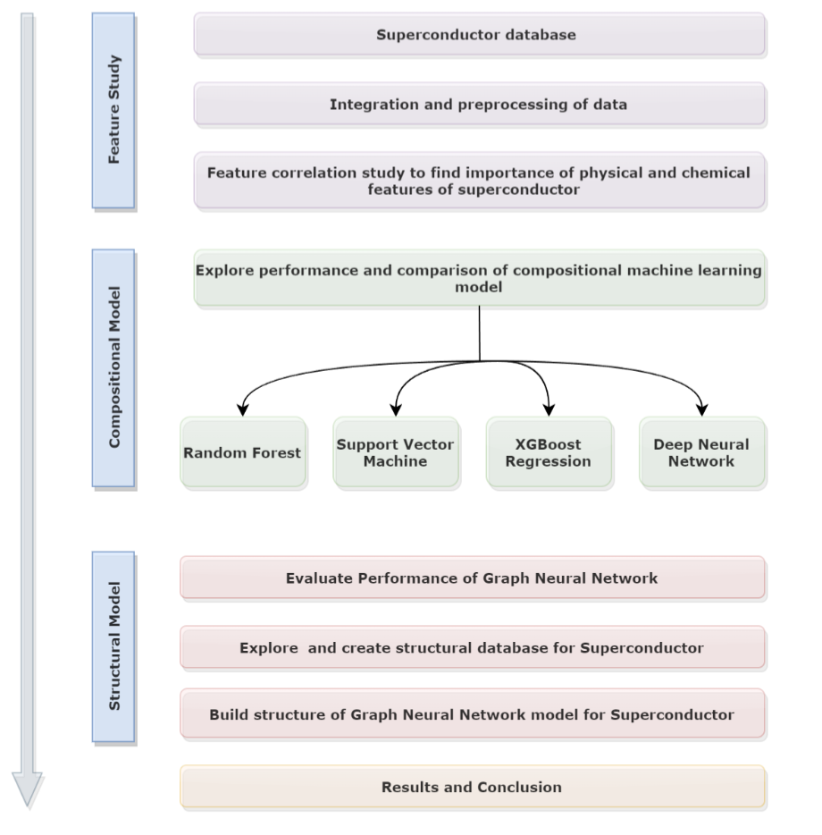

# Machine learning for the prediction of critical temperature of superconductors
Since we already have information and databases on many superconductors as a result of
years of research in superconductivity, a data-driven model can be a good approach to predict
Tc of superconductors, which can relate the superconductivity with physical and chemical
properties of superconductors. Machine learning approach is one of the most widely used methods to predict Tc of supercon-
ductors among data-driven models, and the main focus of this thesis is to optimize different
machine learning models using different approaches such as data correlation, superconductor
categorization, and so on. The goal of this model will be to reliably anticipate the Tc of
superconductors, regardless of their kind or complexity. In recent years, machine learning has
been utilized in material science to uncover hidden patterns and trends in data and generate
predictions. With more data available than ever before and more computing capacity, solely
data-driven methods bypass long-term research and costs associated with making predictions
about something.
Interpreting the physics behind superconductors without just naively forecasting Tc is one
of the most difficult issues for machine learning models. To interpret a model, it is crucial
to look at each characteristic in depth and try to figure out how they affect the output and
model. In this thesis, a second investigation was conducted to investigate the relationship
between model features and superconductivity. This was accomplished by segmenting the
database into separate groups for a more in-depth analysis of the attributes.

## Scope of this thesis can be summarized as follows:
- Creation of database for superconductor and method to make it more suitable for
machine learning models.
- Superconductor classification based on critical temperature and superconductor theories.
- Feature study to find correlation between different physical and chemical features of
element and their impact on critical temperature of superconductors.
- Comparison of the effectiveness, computation, and capacity of several machine learning
regression models to forecast the critical temperature of even complex superconductors,
as well as exploration and optimization of these models to increase prediction accuracy.
- Conceptualization of GNN and application to predict Tc of superconductor.
